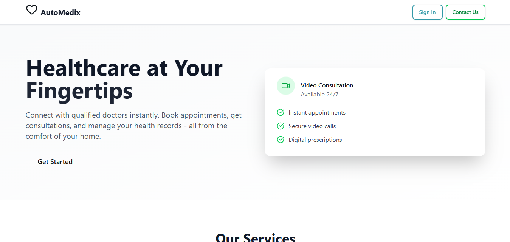

# ✨ Automedix – Complete Healthcare Solution ✨  
<p align="center">
  
</p>  

---

## 🚀 About the Project  
Automedix is **not just an appointment booking app** or a simple consultation tool.  
It is a **complete digital healthcare solution** designed to bridge the gap between **patients, doctors, and admins** – making healthcare smarter, more connected, and accessible.  

Built with ❤️, dedication, and countless hours of effort by **Me & [Hadia Imran](https://github.com/hadiaimran1090)**, Automedix integrates powerful features like:  
- Online/Offline Appointments  
- Video/Audio Consultations (Daily.co)  
- Secure Online Payments (Stripe)  
- Messaging System  
- Medical Reports Sharing  
- Prescriptions Management  
- Analytics Dashboard (Chart.js)  
- Admin Control Panel  
- Contact Admin via **EmailJS**  

---

## 🛠️ Tech Stack  

<p align="center">
  
  
  
  
  
  
  
  
  
  
  
  
  
  
  
  
</p>  

---

## ⚡ Features  

### 👨‍⚕️ Patient  
- Book appointments (video/audio or physical)  
- Pay securely via Stripe  
- Share medical reports & prescriptions  
- Direct messaging with doctor  
- Cancel appointments in emergencies  
- Feedback system  
- Manage profile  

### 👩‍⚕️ Doctor  
- Admin-approved registration  
- Manage appointments & patients  
- Access medical reports  
- Messaging & notifications  
- Video consultations  
- Track payments  
- Update profile  

### 🛡️ Admin  
- Approve/Reject doctor profiles  
- View/manage all doctors & patients  
- Notifications center  
- Analytics dashboard with Chart.js  
- Direct contact system (via EmailJS)  

---

## ⚙️ Setup & Installation  

### 🔹 Prerequisites  
- [Node.js](https://nodejs.org/) (v16+)  
- [MongoDB](https://www.mongodb.com/atlas/database) Atlas or Local instance  
- Git  
- VS Code or any IDE
- **Stripe API Keys**  
- **Daily.co API Key**  
- **cloudinary Account**

### 🔹 Steps to Run Locally  

1. **Fork or Download the Repository**  
   - Click on **Fork** (top right) or **Download ZIP** and extract it.  
   - Open the project in **VS Code**.  

2. **Backend Setup**  
   ```bash
   cd backend
   npm install
3. **Frontend Setup**  
   ```bash
   cd frontend
   npm install

4. **Run the Project**
   ```bash
   npm run dev
5. **Default URLs**
     ```bash
     Frontend: http://localhost:5173
     Backend: http://localhost:5000
6. **.ENV Setup**
   -rename the **.env.local** to **.env**
   -- **Add** your **keys**
### 👥 Contributors  

<a href="https://github.com/hadiaimran">
  
</a>  
<br/>
<a href="https://github.com/hadiaimran1090"><b>Hadia Imran</b></a>


## 🎬 Demo

[](https://drive.google.com/file/d/1T155QO2CZgp0AXMmRbaVdVTrDbxUEeDB/view?usp=sharing)
---

## 🌟 Support & Contribution  

If you find this project helpful, please consider giving it a **⭐ Star** on GitHub — it helps a lot! 🚀  

<p align="center">
  
</p>
